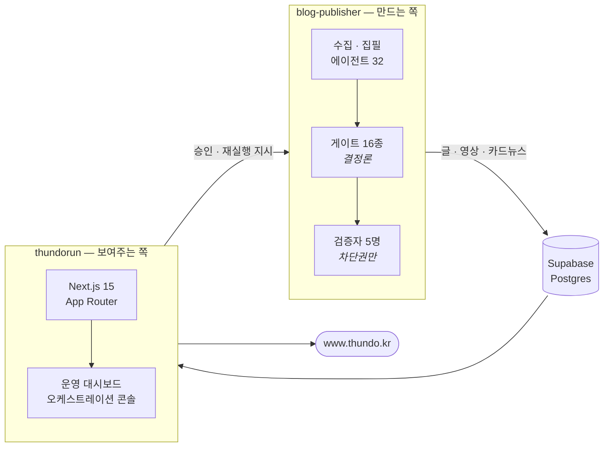
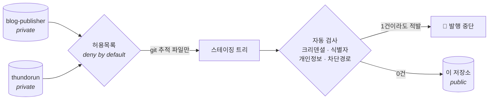
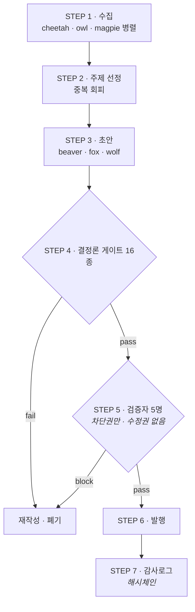

<div align="center">

# Thundo

**AI 에이전트 32마리가 매일 콘텐츠를 만들고, 그 결과를 보여주는 시스템**

사람이 손대지 않아도 매일 블로그 3편·유튜브 쇼츠·인스타 카드뉴스가 나갑니다.<br>
핵심은 "많이 만드는 것"이 아니라 **못 만든 걸 내보내지 않는 것** — 결정론 게이트 16종과 검증자 5명이 막습니다.

[](#이-저장소는-스냅샷입니다)
[](#에이전트-32마리)
[](#품질-게이트-16종)
[](https://nodejs.org)
[](https://nextjs.org)
[](./LICENSE)

**산출물 → [www.thundo.kr](https://www.thundo.kr)**

<table>
<tr>
<td align="center"><br><sub><b>매일 3편 자동 발행</b> — 수집·집필·검증·발행 전 과정 무인</sub></td>
<td align="center"><br><sub><b>썸네일·더빙·자막까지 자동</b> — 9:16 쇼츠 생성 파이프라인</sub></td>
</tr>
</table>

</div>

---

## 두 개의 저장소, 하나의 시스템



| 디렉토리 | 무엇인가 | 스택 |
|---|---|---|
| **[`blog-publisher/`](./blog-publisher)** | 한국어 콘텐츠 자동발행 파이프라인 — 수집부터 발행·감사까지 | Node.js · 런타임 의존성 1개 |
| **[`thundorun/`](./thundorun)** | 결과물을 보여주는 개인 홈페이지 + 운영 대시보드 | Next.js 15 · React 19 · Supabase · Vercel |

파이프라인이 DB 에 쓰면 사이트가 읽어 보여주고, 관리자가 콘솔에서 내린 지시가 다시 파이프라인으로 돌아가는 **양방향** 구조입니다.

---

## 이 저장소는 스냅샷입니다

개발은 비공개 저장소에서 하고, **공개할 수 있는 파일만 골라 특정 시점마다 스냅샷으로** 이곳에 올립니다.
그래서 커밋 로그는 `snapshot YYYY-MM-DD — 설명` 형태이고, 개발 과정의 커밋 하나하나는 남아 있지 않습니다.

원본 저장소의 **이력**에 제3자(거래처) 운영 정보와 개인 정보가 섞여 있기 때문입니다. 현재 파일을 지워도 과거 커밋에서 복원되므로, 이력을 세탁해 공개하는 대신 **이력을 아예 넘기지 않는 쪽**을 택했습니다.



- **허용목록에 없으면 나가지 않습니다.** 후보 자체가 git 추적 파일로 한정되어, 추적되지 않은 로컬 산출물은 구조적으로 유출될 수 없습니다.
- **발행 직전 전수 검사**를 통과해야 커밋됩니다 — API 키·토큰·PEM·웹훅·개인 이메일·차단 경로. 하나라도 걸리면 발행이 멈춥니다.
- 검사 자체는 **역검증 테스트 39종**으로 고정돼 있습니다. "스캐너가 돈다"가 아니라 "심어놓은 민감정보를 실제로 잡아낸다"를 검증합니다.

> [!NOTE]
> **바로 실행되는 상태는 아닙니다.** 운영 설정·크리덴셜·런타임 상태는 빠져 있습니다. 설계와 구현을 읽는 용도로 봐 주세요.
> `blog-publisher` 는 크리덴셜 없이 도는 mock 모드가 있어 파이프라인 전 과정을 로컬에서 확인할 수 있습니다.

---

## blog-publisher — 만드는 쪽

매일 정해진 시각에 주제를 모으고, 초안을 쓰고, 검사를 통과한 글만 발행합니다.



**게이트가 먼저, LLM 판정이 나중입니다.** 기계가 셀 수 있는 것(중복률·길이·링크 생존·구체문장 비율)은 결정론 코드가 판정하고, LLM 검증자는 그걸 통과한 것만 봅니다. 검증자에게는 **차단권만 있고 수정권이 없습니다** — 고쳐 쓰기 시작하면 무엇이 걸러졌는지 알 수 없게 되기 때문입니다.

### 만들어내는 것

| 채널 | 무엇을 | 어떻게 |
|---|---|---|
| **블로그** | 매일 3편 (1500~2000 음절) | 수집 → 초안 → 게이트 16 → 검증자 5 → 발행 |
| **유튜브 쇼츠** | 발행글 1편 → 9:16 영상 | AI 배경 + 켄번스 모션 + TTS 더빙 + 자동 자막 |
| **호기심 쇼츠** | 독립 채널 "설마 진짜?" | 백로그 → 반전점수 best-pick → 팩트체크 → JIT 제작 |
| **인스타 카드뉴스** | 하루 2편 | 고전문학 구절로 건네는 위로 · **원문 대조** 인용 게이트 |
| **티스토리 교차발행** | 발행글 미러 | 톤 재작성 후 브라우저 자동 게시 |

### 품질 게이트 16종

`npm run gate <file>` 로 일괄 실행. exit 0=통과, 1=실패, 2=실행오류. 전부 규칙 기반이라 **같은 입력에 같은 판정**이 나옵니다.

| # | 게이트 | 무엇을 잡나 |
|---|---|---|
| 1–4 | `dup` `length` `banned` `lint` | 기존 글과 중복(4-gram MinHash) · 분량 이탈 · 금지어 · 마크다운 린트 |
| 5–8 | `links` `empty` `ai-tells` `sources` | 죽은 링크와 **인용세탁** · 빈 섹션 · 한국어 AI 티 · 빈 URL·무출처 통계 |
| 9–12 | `credibility` `density` `hedge` `internal-dup` | 가짜 전문성 · 얕은 일반론 · 헤징 남발 · 글 안에서 같은 말 반복 |
| 13–16 | `niche` `render-fit` `seo` `source-fidelity` | 주제 이탈 · 렌더 부적합 · SEO 기본요소 · 원문 사실 대조 |

전체 판정 기준은 [`blog-publisher/README.md`](./blog-publisher#품질-게이트-16종) 에 있습니다.

### 에이전트 32마리

<table>
<tr><th align="left">팀</th><th align="left">구성</th></tr>
<tr>
<td><b>발행 17</b></td>
<td>
<b>Lion</b> 오케스트레이터 · <b>Cheetah/Owl/Magpie</b> 수집 · <b>Beaver/Fox/Wolf</b> 작가 ·
<b>Eagle/Bee/Swan/Raven/Peacock</b> 검증(차단권만) · <b>Penguin</b> 발행 ·
<b>Elephant</b> 거버넌스 · <b>Crane</b> 건강검진 · <b>Meerkat</b> 관제탑 · <b>Hummingbird</b> SEO 방법론
</td>
</tr>
<tr>
<td><b>개발·운영 5</b></td>
<td>
🦜 <b>Parrot</b> 프로젝트 브리핑 · 🕷 <b>Spider</b> 정찰 · 🐦 <b>Woodpecker</b> 인프라 관제 ·
🪿 <b>Goose</b> 사이트 관제 · 🐕 <b>Sheepdog</b> 파이프라인 자가복구
<br><sub>전부 <b>읽기 전용</b> — 수정·재시작·배포 권한 없음</sub>
</td>
</tr>
<tr>
<td><b>호기심 쇼츠 5</b></td>
<td>🦝 <b>Raccoon</b> 발굴 · <b>Lynx</b> 선정 · <b>Badger</b> 팩트체크 · <b>Nightingale</b> 대본 · 🦊 <b>Fennec</b> 총괄</td>
</tr>
<tr>
<td><b>카드뉴스 5</b></td>
<td>🪶 <b>Heron</b> 발굴 · 🦌 <b>Deer</b> 선정 · 🦔 <b>Hedgehog</b> 인용검증 · 🐦 <b>Robin</b> 작가 · ✨ <b>Firefly</b> 총괄</td>
</tr>
</table>

각 에이전트의 페르소나는 `.claude/agents/<name>.md` 에 있고, 스크립트가 그 정의를 프롬프트 선두에 주입합니다 — 정의가 실제 출력을 좌우합니다(장식이 아닙니다).

---

## thundorun — 보여주는 쪽

<div align="center">

</div>

발행된 글을 보여 주는 개인 홈페이지이자, 파이프라인을 들여다보고 조종하는 운영 대시보드입니다.

- **Next.js 15 App Router · React 19 · Supabase · next-auth**
- 서버 컴포넌트에서만 DB 를 읽고, 클라이언트로는 anon 키 경로를 만들지 않습니다
- 관리자 API 는 미들웨어와 핸들러에서 **이중으로** 막습니다
- **순수 CSS 디자인 시스템** ([`DESIGN.md`](./thundorun/DESIGN.md)) — Tailwind·UI 라이브러리 없음
- 모바일 우선 반응형 · 다크 모드

---

## 설계에서 지키는 것

**감사로그는 append-only 해시체인입니다.** 과거 기록을 고치면 체인이 깨지고, `npm run audit:verify` 가 잡아냅니다.

**예산에 하드캡이 있습니다.** 일일 상한을 넘으면 런이 즉시 중단됩니다.

**크리덴셜이 없으면 자동으로 mock 으로 내려갑니다.** `RUN_MODE=live` 를 요청해도 필수 키가 없으면 mock 으로 전환합니다 — 절반만 실행되는 상태를 만들지 않습니다.

**자가발전은 삼권분립입니다.** 제안 ↔ 채점 ↔ 적용이 분리돼 있고, 적용기는 시드·게이트·watchdog·감사로그를 건드리는 변경을 거부합니다. 단조성 회귀 게이트(fitness +2% & 무회귀)를 통과한 변종만 채택됩니다.

**인용은 LLM 이 아니라 원문이 판정합니다.** 카드뉴스의 고전문학 인용은 원문 전문을 받아 실제로 구절을 찾습니다 — 못 찾으면 LLM 은 호출조차 되지 않습니다. 인터넷에는 "그 책에 없는데 그 책 것으로 떠도는 문장"이 대량으로 있고, LLM 은 거기에 출처까지 그럴듯하게 붙이기 때문입니다.

---

## 하지 않는 것

- **캡차를 우회하지 않습니다.** Cloudflare 가 막는 플랫폼은 자동 게시를 포기하고 수동으로 둡니다. 캡차 대행·핑거프린트 스푸핑·탐지 회피는 계정 정지와 유지보수 지옥을 부르므로 **요청받아도 거부합니다.**
- **스크래핑하지 않습니다.** 네이버는 공식 검색 OpenAPI 만 씁니다.
- **관측 에이전트는 아무것도 고치지 않습니다.** 읽기 전용 게이트웨이로만 접근하고, 쓰기·경로 이탈은 게이트웨이가 기술적으로 차단합니다.

---

## 구조

```
thundo-agent-public/
├── blog-publisher/          # 만드는 쪽
│   ├── scripts/
│   │   ├── run-lion.mjs     #   메인 오케스트레이터
│   │   ├── gates/           #   결정론 품질 게이트 16종
│   │   ├── seo/             #   GSC 폐루프 · 검색 순위 추적
│   │   ├── shorts/          #   유튜브 쇼츠 (공용 제작 코어)
│   │   ├── cardnews/        #   인스타 카드뉴스 (원문대조 인용게이트)
│   │   ├── crosspub/        #   외부 플랫폼 교차발행
│   │   ├── watchdog/        #   예산 · killswitch · lock · 자가복구
│   │   └── test/            #   smoke 19 · 채널별 테스트
│   ├── .claude/agents/      # 에이전트 페르소나 정의
│   └── config/              # JSON 설정
│
└── thundorun/               # 보여주는 쪽
    ├── web/src/             #   Next.js App Router
    ├── web/supabase/        #   스키마 · 마이그레이션
    ├── web/e2e/             #   Playwright E2E
    └── DESIGN.md            # 순수 CSS 디자인 시스템
```

---

## 라이선스

[MIT](./LICENSE)
