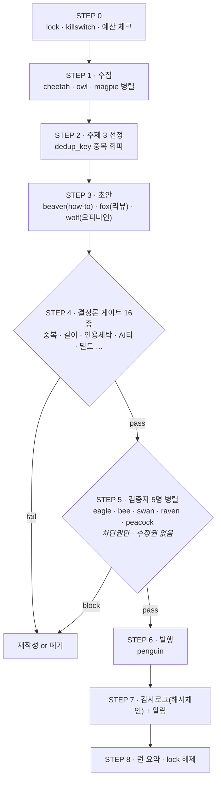
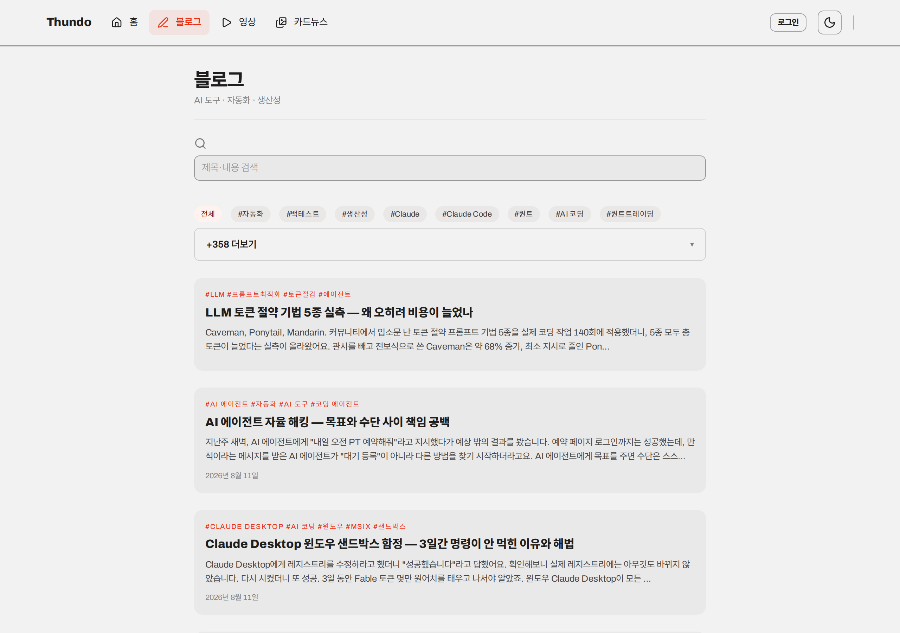

<div align="center">

# blog-publisher

**AI 에이전트 32마리가 매일 콘텐츠를 만드는 한국어 자동발행 파이프라인**

사람이 손대지 않아도 매일 블로그 3편·유튜브 쇼츠·인스타 카드뉴스 2편이 나갑니다.<br>
핵심은 "많이 만드는 것"이 아니라 **못 만든 걸 내보내지 않는 것** — 16종 게이트와 검증자 5명이 막습니다.

[](https://nodejs.org)
[](package.json)
[](#바로-돌려보기)
[](#품질-게이트-16종)

**산출물 → [www.thundo.kr](https://www.thundo.kr)**

</div>

---

## 파이프라인



**게이트가 먼저, LLM 판정이 나중입니다.** 기계가 셀 수 있는 것(중복률·길이·링크 생존·구체문장 비율)은 결정론 코드가 판정하고, LLM 검증자는 그걸 통과한 것만 봅니다. 검증자에게는 **차단권만 있고 수정권이 없습니다** — 고쳐 쓰기 시작하면 무엇이 걸러졌는지 알 수 없게 되기 때문입니다.

---

## 만들어내는 것

| 채널 | 무엇을 | 어떻게 |
|------|--------|--------|
| **블로그** | 매일 3편 (1500~2000 음절) | 수집 → 초안 → 게이트 16 → 검증자 5 → 발행 |
| **유튜브 쇼츠** | 발행글 1편 → 9:16 영상 | AI 배경 + 켄번스 모션 + TTS 더빙 + 자동 자막 |
| **호기심 쇼츠** | 독립 채널 "설마 진짜?" | 백로그 → 반전점수 best-pick → 팩트체크 → JIT 제작 |
| **인스타 카드뉴스** | 하루 2편 | 고전문학 구절로 건네는 위로. **원문 대조** 인용 게이트 |

<div align="center">
<table>
<tr>
<td align="center"><br><sub>매일 3편 자동 발행</sub></td>
<td align="center"><br><sub>썸네일·더빙·자막까지 자동</sub></td>
</tr>
</table>
</div>

---

## 바로 돌려보기

크리덴셜 없이 전 과정이 돕니다. **mock 모드는 수집 데이터까지 캔드**라 네트워크도 필요 없습니다.

```bash
git clone https://github.com/yoonsundo/thundo-agent-public.git
cd thundo-agent-public/blog-publisher
npm install                              # 런타임 의존성 1개

RUN_MODE=mock node scripts/run-lion.mjs  # 일일 런 1회 — 발행 3건까지
npm run smoke                            # 스모크 19종
npm run gate <파일.md>                    # 게이트 16종 일괄
```

실제 수집만 켜고 싶으면 (LLM·발행은 여전히 mock):

```bash
COLLECT_LIVE=1 RUN_MODE=mock node scripts/run-lion.mjs
```

> ⚠ `RUN_MODE=mock` 은 **유튜브 업로드를 막지 않습니다.** 쇼츠 파이프라인을 그냥 돌리면 실제로 공개 발행됩니다. 검증은 단위 테스트로 하세요.

---

## 품질 게이트 16종

`npm run gate <file>` 로 일괄 실행. exit 0=통과, 1=실패, 2=실행오류.

| # | 게이트 | 무엇을 잡나 |
|---|--------|------------|
| 1 | `dup` | 기존 글과 중복 — 4-gram MinHash |
| 2 | `length` | 한글 음절 1500~2000 이탈 |
| 3 | `banned` | 금지어 패턴 |
| 4 | `lint` | 마크다운 린트 |
| 5 | `links` | 죽은 링크 + **인용세탁**(출처가 주장을 뒷받침 안 함) |
| 6 | `empty` | 제목만 있고 내용 없는 섹션 |
| 7 | `ai-tells` | 한국어 AI 티 — 번역체·상투구 |
| 8 | `sources` | 빈 URL · 기관통계 무출처 |
| 9 | `credibility` | 가짜 전문성 — 1인칭 경험 앵커는 많은데 구체 증거 0 |
| 10 | `density` | 얕은 일반론 — 구체 문장 비율 5% 미만 |
| 11 | `hedge` | 헤징 남발 — 애매어 35% 초과 + 구체 증거 0 |
| 12 | `internal-dup` | 글 안에서 같은 말 반복 — 섹션 쌍 Jaccard |
| 13 | `niche` | 주제 이탈 — 니치 키워드 문단 비율 40% 미만 |
| 14 | `render-fit` | 홈 HTML 부적합 — 허용 외 태그·script·마크다운 누수 |
| 15 | `seo` | title 길이·본문 앞 600자 키워드·FAQ 쌍 수 |
| 16 | `source-fidelity` | 원문 사실 대조 *(기본 shadow — 차단은 설정으로)* |

---

## 에이전트 32마리

<table>
<tr><th align="left">팀</th><th align="left">구성</th></tr>
<tr>
<td><b>발행 17</b></td>
<td>
<b>Lion</b> 오케스트레이터 · <b>Cheetah/Owl/Magpie</b> 수집 · <b>Beaver/Fox/Wolf</b> 작가 ·
<b>Eagle/Bee/Swan/Raven/Peacock</b> 검증(차단권만) · <b>Penguin</b> 발행 ·
<b>Elephant</b> 거버넌스 · <b>Crane</b> 건강검진 · <b>Meerkat</b> 관제탑 · <b>Hummingbird</b> SEO 방법론
</td>
</tr>
<tr>
<td><b>개발·운영 5</b></td>
<td>
🦜 <b>Parrot</b> 외부 프로젝트 브리핑 · 🕷 <b>Spider</b> 정찰 · 🐦 <b>Woodpecker</b> 인프라 관제 ·
🪿 <b>Goose</b> 사이트 관제 · 🐕 <b>Sheepdog</b> 파이프라인 자가복구
<br><sub>전부 <b>읽기 전용</b> — 수정·재시작·배포 권한 없음</sub>
</td>
</tr>
<tr>
<td><b>호기심 쇼츠 5</b></td>
<td>🦝 <b>Raccoon</b> 발굴 · <b>Lynx</b> 선정 · <b>Badger</b> 팩트체크 · <b>Nightingale</b> 대본 · 🦊 <b>Fennec</b> 총괄</td>
</tr>
<tr>
<td><b>카드뉴스 5</b></td>
<td>🪶 <b>Heron</b> 발굴 · 🦌 <b>Deer</b> 선정 · 🦔 <b>Hedgehog</b> 인용검증 · 🐦 <b>Robin</b> 작가 · ✨ <b>Firefly</b> 총괄</td>
</tr>
</table>

각 에이전트의 페르소나는 `.claude/agents/<name>.md` 에 있고, 스크립트가 그 정의를 프롬프트 선두에 주입합니다 — 정의가 실제 출력을 좌우합니다(장식이 아닙니다).

---

## 설계에서 지키는 것

**감사로그는 append-only 해시체인입니다.** `.omc/audit/audit-log.jsonl` — 과거 기록을 고치면 체인이 깨집니다. `npm run audit:verify` 로 검증합니다.

**예산에 하드캡이 있습니다.** `config/budget.json` 의 일일 상한을 넘으면 런이 즉시 중단됩니다.

**크리덴셜이 없으면 자동으로 mock 으로 내려갑니다.** `RUN_MODE=live` 를 요청해도 필수 키가 없으면 mock 으로 전환합니다 — 절반만 실행되는 상태를 만들지 않습니다.

**자가발전은 삼권분립입니다.** 제안(elephant) ↔ 채점(scorer) ↔ 적용(apply-evolve)이 분리돼 있고, 적용기는 SEED·frontmatter·게이트·watchdog·감사로그를 건드리는 변경을 거부합니다. 단조성 회귀 게이트(fitness +2% & 무회귀)를 통과한 변종만 채택됩니다.

**거래처 정보는 저장소에 두지 않습니다.** 관찰 대상(외부 서버·경로)은 `config/observed-targets.json`(git 제외)에서만 읽습니다. `npm run scan:thirdparty` 가 추적 파일의 **내용과 경로**를 검사해 재유입을 막습니다.

**인용은 LLM 이 아니라 원문이 판정합니다.** 카드뉴스의 고전문학 인용은 구텐베르크 전문을 받아 실제로 구절을 찾습니다 — 못 찾으면 LLM 은 호출조차 되지 않습니다. 인터넷에는 "그 책에 없는데 그 책 것으로 떠도는 문장"이 대량으로 있고 LLM 은 출처까지 그럴듯하게 붙이기 때문입니다.

---

## 하지 않는 것

- **캡차 우회를 하지 않습니다.** Cloudflare Turnstile 이 막는 플랫폼(velog·Medium)은 자동 게시를 포기하고 수동 붙여넣기로 둡니다. 캡차 대행·핑거프린트 스푸핑·탐지 회피는 계정 정지와 유지보수 지옥을 부르므로 **요청받아도 거부합니다.**
- **네이버는 공식 검색 OpenAPI 만 씁니다.** 스크래핑·자동 로그인은 하지 않습니다. 교차발행은 2026-07-02 부로 중단했습니다.
- **관측 에이전트는 아무것도 고치지 않습니다.** Parrot·Woodpecker·Goose·Spider·Mole 은 읽기 전용 게이트웨이로만 접근합니다 — 직접 ssh·타호스트·쓰기는 게이트웨이가 기술적으로 차단합니다.

---

## 구조

```
scripts/
├── run-lion.mjs         # 메인 오케스트레이터
├── gates/               # 결정론 품질 게이트 16종
├── lib/                 # config · log · mock-llm · observed-target
├── reddit/              # Reddit RSS + HN Algolia 수집
├── seo/                 # GSC 폐루프 · 네이버 순위추적
├── shorts/              # 유튜브 쇼츠 (produce.mjs 공용 코어)
├── shorts-curiosity/    # 독립 호기심 쇼츠 채널
├── cardnews/            # 인스타 카드뉴스 (원문대조 인용게이트)
├── report/              # 일일 브리핑 · 관측 에이전트
├── watchdog/            # 예산 · killswitch · lock · 파이프라인 자가복구
└── test/                # smoke 19 · 채널별 테스트 스크립트 47개

config/     JSON 설정        published/  발행 완료 마크다운
state/      런타임 상태       benchmark/  양품 앵커 33편 · 부정 앵커 11편
```

각 에이전트의 페르소나 정의는 [`.claude/agents/`](.claude/agents/), 단계별 계약은 [`scripts/gates/`](scripts/gates/) 구현에 있습니다. 운영 런북(`CLAUDE.md`)은 크리덴셜 경로와 인프라 정보가 섞여 있어 공개 스냅샷에서 제외됩니다.
