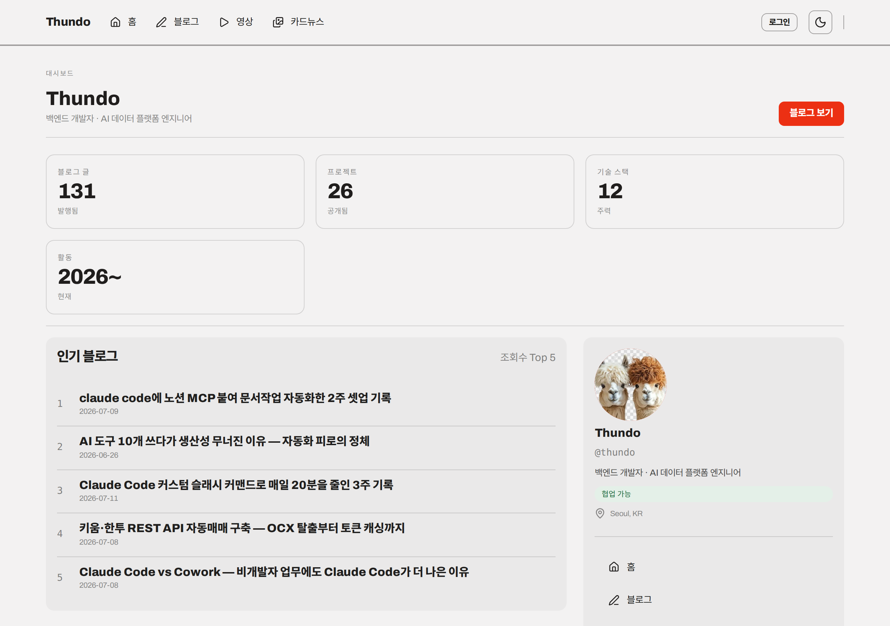
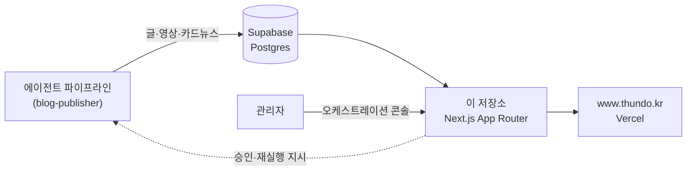
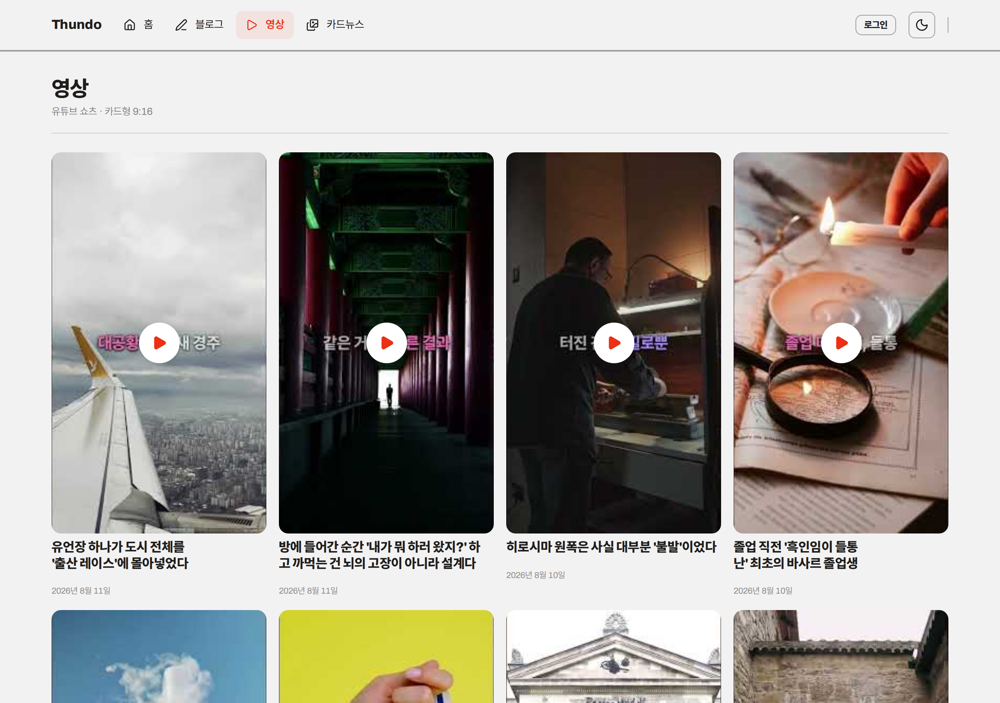
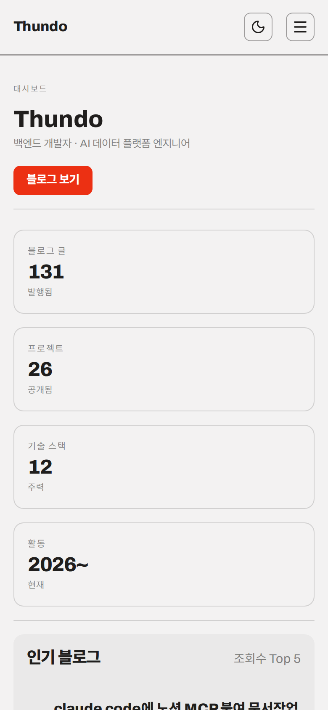

<div align="center">

# Thundo

**AI 에이전트 32마리가 매일 콘텐츠를 만들고, 그 결과를 보여주는 사이트**

블로그·유튜브 쇼츠·인스타 카드뉴스가 사람 손 없이 매일 발행됩니다.<br>
이 저장소는 그 결과물을 보여주고 파이프라인을 조종하는 **웹 애플리케이션**입니다.

[](https://nextjs.org)
[](https://react.dev)
[](https://www.typescriptlang.org)
[](https://supabase.com)
[](https://vercel.com)

**[www.thundo.kr →](https://www.thundo.kr)**



</div>

---

## 무엇을 하는 사이트인가

콘텐츠를 **만드는 쪽**은 별도 저장소([blog-publisher](https://github.com/yoonsundo/thundo-agent-public))의 에이전트 파이프라인입니다.
이 저장소는 그 파이프라인이 만든 것을 **보여주고 조종하는 쪽**입니다.



파이프라인이 DB 에 쓰면 사이트가 읽어 보여주고, 관리자가 콘솔에서 내린 지시가 다시 파이프라인으로 돌아가는 **양방향** 구조입니다.

---

## 화면

| 블로그 | 영상 |
|:-:|:-:|
|  |  |
| 매일 3편씩 자동 발행된 글. 태그·검색·페이지네이션 | 9:16 쇼츠. 썸네일·더빙·자막까지 자동 생성 |

<div align="center">

<p><em>모바일 우선 — 전 화면 반응형</em></p>
</div>

---

## 주요 기능

### 공개 화면

- **블로그** — 131편 발행. 태그 필터·본문 검색·페이지네이션. 관련글은 태그 Jaccard 유사도로 자동 선정
- **영상** — 유튜브 쇼츠 카드형 목록. 클릭하면 인라인 재생
- **카드뉴스** — 인스타그램 캐러셀 아카이브
- **리포트** — 트래픽·검색 성과 요약

### 관리자 콘솔

- **오케스트레이션** — 자연어로 요청하면 기획 → 승인 → 격리 워크트리 실행 → 커밋 → 배포까지 자동. 요청은 `요청중 → 보류 → 승인 → 완료` 로 상태가 추적됩니다
- **에이전트 관제** — 32마리의 상태·최근 실행·실패 로그
- **자가 조치(remediation)** — 이상 감지 시 조치안을 제시하고, **승인 전에는 아무것도 바꾸지 않습니다**. 승인 → 배포 → 재측정 → 실패 시 자동 롤백
- **포트폴리오·공지 CRUD**

---

## 설계에서 지키는 것

**단일 디자인 시스템.** UI 는 Modernist Kit 순수 CSS 만 씁니다. Tailwind·Radix 는 제거했습니다.
`npm run test:design` 이 이걸 강제합니다 — 새 클래스는 `globals.css` 와 `DESIGN.md §11` **양쪽에** 등록돼야 통과합니다. 한쪽만 고치면 빌드가 막힙니다.

**캐시 정책은 라우트가 정합니다.** 전역 `no-store` 를 강제하지 않습니다.
`no-store` fetch 하나가 그 라우트를 통째로 동적 렌더링으로 강등시키기 때문입니다 —
공개 화면은 `revalidate = N`, 관리자·API 는 `force-dynamic` 을 각자 선언합니다.

**목록은 본문을 앱까지 끌어오지 않습니다.** 검색은 DB(`ilike`)가 하고 앱은 slug 집합만 받습니다.
예전엔 10편을 보여주려고 매 요청 131편 전문(4.44MB)을 끌어왔고, 글 1편당 요청이 34KB 씩 무거워졌습니다.

**시크릿은 커밋 전에 막습니다.** `npm run scan:secrets` 가 추적 파일을 검사합니다.

---

## 시작하기

```bash
git clone https://github.com/yoonsundo/thundorun.git
cd thundorun/web
npm install

cp .env.example .env.local     # Supabase URL·키 입력
npm run dev                    # http://localhost:3000
```

`.env.local` 없이도 뜹니다 — DB 로더가 빈 배열을 반환해 빈 화면이 렌더됩니다.

### 검사

| 명령 | 하는 일 |
|------|---------|
| `npm run test` | 단위 테스트 (vitest) |
| `npm run test:design` | 디자인 시스템 가드 — 미등록 클래스 차단 |
| `npm run test:ui` | 실제 브라우저로 레이아웃 감사 |
| `npm run test:e2e` | Playwright E2E |
| `npm run scan:secrets` | 추적 파일 시크릿 스캔 |
| `npm run lint` | ESLint |

---

## 구조

```
web/
├── src/app/
│   ├── (site)/          # 공개 화면 — 홈·블로그·영상·카드뉴스·리포트
│   ├── admin/           # 관리자 — 오케스트레이션·에이전트·자가조치·CRUD
│   └── api/             # 33개 라우트 핸들러
├── src/lib/             # Supabase 클라이언트·블로그 로더·인증
├── src/test/            # vitest — 디자인 가드 포함
└── scripts/             # 시크릿 스캔·UI 감사
```

디자인 규칙은 [`DESIGN.md`](DESIGN.md) 에 있습니다.

---

<div align="center">
<sub>스크린샷은 <code>docs/screenshots/</code> — 라이브 사이트에서 Playwright 로 캡처했습니다.</sub>
</div>
